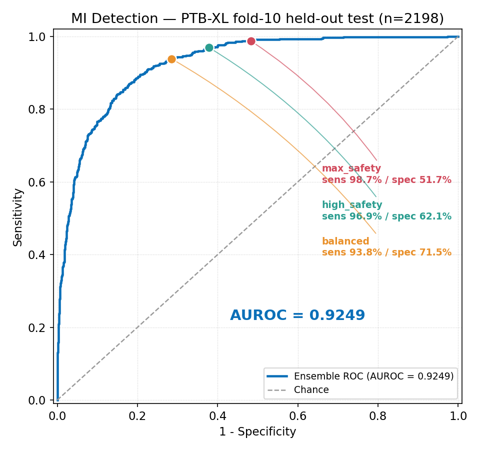

# ECG ED Triage — Myocardial Infarction Detection from 12-Lead ECG

A research prototype that flags myocardial infarction (MI) from a standard
12-lead ECG, built as a decision-support aid for emergency-department triage.
A 3-model ResNet ensemble outputs an MI probability with three
selectable operating points (safety-first → screening).

> ⚠️ **Research prototype only.** This is **not** a medical device. It is **not**
> FDA/CE cleared and **must not** be used for clinical decision-making or patient
> care. It is provided for research and reproducibility purposes only.

## Headline result

**TEST (fold 10) AUROC = 0.9249** — PTB-XL, patient-grouped hold-out.



Evaluated with a strict, patient-grouped split using PTB-XL's official
`strat_fold` column (no patient appears in more than one fold):

| Split | Fold | n | MI | AUROC |
|-------|------|------|-----|--------|
| Train | 1–8  | —    | —   | —      |
| Val   | 9    | 2183 | 537 | 0.9247 |
| **Test**  | **10**   | **2198** | **550** | **0.9249** |

3-model ensemble (seeds 42 / 142 / 242), ensemble probability = mean of
per-model `softmax(logits)[MI]`.

> **Note on methodology.** Thresholds and all reported operating points are
> tuned on **fold 9 only** and measured on the untouched **fold 10** test set.
> Earlier random-split numbers (≈0.94) are **deprecated** — they were not
> patient-grouped and are not reported here. See [`RESULTS.txt`](RESULTS.txt)
> for the canonical, reproducible figures.

## Operating points

Thresholds tuned on fold 9, measured on fold 10:

| Mode | Threshold | Sensitivity | Specificity | Intended use |
|------|-----------|-------------|-------------|--------------|
| `max_safety`  | 0.1867 | 98.73% | 51.70% | ED, unstable / high-risk patients — minimize missed MI |
| `high_safety` | 0.2350 | 96.91% | 62.14% | ED standard triage (recommended default) |
| `balanced`    | 0.2975 | 93.82% | 71.54% | Outpatient screening |

## Reproduce the fold-10 results (0.9249)

The 3 ensemble weights are committed to `models/`, so reproducing the canonical
metrics only requires adding the PTB-XL dataset (~1.7 GB, not redistributed here;
open access, no login). Run this top to bottom from a fresh clone:

```bash
# 1. clone
git clone https://github.com/aru-yadav/ecg-ed-triage
cd ecg-ed-triage

# 2. download PTB-XL v1.0.3 (~1.7GB) — into the repo's data/raw/
mkdir -p data/raw
wget -O data/raw/ptbxl.zip https://physionet.org/content/ptb-xl/get-zip/1.0.3/

# 3. unzip (extracts to the versioned folder data.py expects)
cd data/raw && unzip -q ptbxl.zip && rm ptbxl.zip && cd ../..
# after this, the data is at:
#   data/raw/ptb-xl-a-large-publicly-available-electrocardiography-dataset-1.0.3/
# containing ptbxl_database.csv and records100/  (no extra nesting)

# 4. install (a virtualenv is recommended) + reproduce
python -m venv .venv && . .venv/bin/activate     # Windows: .venv\Scripts\activate
pip install -r requirements.txt
PYTHONPATH=src python -m ecg_triage.check         # optional: verify readiness
PYTHONPATH=src python -m ecg_triage.evaluate
```

The zip's single top-level folder is named
`ptb-xl-a-large-publicly-available-electrocardiography-dataset-1.0.3`, which is
exactly the path `src/ecg_triage/data.py` looks for by default — so step 3 lands
the data in the right place with no move needed.

### Windows

`wget` and `unzip` may not be installed, but Windows 10+ ships `curl.exe` and
`tar` (which extracts zips). In PowerShell:

```powershell
git clone https://github.com/aru-yadav/ecg-ed-triage
cd ecg-ed-triage
New-Item -ItemType Directory -Force data\raw | Out-Null
curl.exe -L -o data\raw\ptbxl.zip https://physionet.org/content/ptb-xl/get-zip/1.0.3/
tar -xf data\raw\ptbxl.zip -C data\raw
Remove-Item data\raw\ptbxl.zip
python -m venv .venv; .venv\Scripts\Activate.ps1
pip install -r requirements.txt
$env:PYTHONPATH = "src"; python -m ecg_triage.check      # optional: verify readiness
$env:PYTHONPATH = "src"; python -m ecg_triage.evaluate
```

### What correct output looks like

The first run preprocesses PTB-XL and caches it to
`data/processed/foldcv_cache.npz` (a few minutes); later runs reuse the cache.
You should see:

```
VAL  (fold 9)  AUROC = 0.9247   n=2183 MI=537
TEST (fold 10) AUROC = 0.9249   n=2198 MI=550
```

followed by the three operating points:

```
max_safety    thr 0.1867  ->  TEST sens 98.73%  spec 51.70%
high_safety   thr 0.2350  ->  TEST sens 96.91%  spec 62.14%
balanced      thr 0.2975  ->  TEST sens 93.82%  spec 71.54%
```

Seeing **TEST AUROC = 0.9249** means it worked — this matches
[`RESULTS.txt`](RESULTS.txt).

### Data anywhere (alternative to the default path)

Skip step 3's location and point `PTBXL_DIR` at the extracted
`ptb-xl-...-1.0.3` folder wherever it lives:

```bash
PTBXL_DIR=/path/to/ptb-xl-a-large-publicly-available-electrocardiography-dataset-1.0.3 \
  PYTHONPATH=src python -m ecg_triage.evaluate
```

## Repository layout

```
src/ecg_triage/     Seeded, patient-grouped fold pipeline (canonical training code)
  data.py           PTB-XL loading, MI labels, strat_fold split (train 1-8 / val 9 / test 10)
  preprocess.py     Bandpass 0.5-40 Hz -> per-lead z-score -> 1000 samples
  model.py          ImprovedECGModel (ResNet-based 1D CNN)
  train.py          Train the 3-seed ensemble        (--data / --models)
  evaluate.py       Reproduce RESULTS.txt             (--data / --models)
  check.py          Environment/data readiness check (python -m ecg_triage.check)
api/                FastAPI inference service (prediction + web UI + PDF reports)
models/             Canonical fold-10 weights + ensemble_config.json (operating points)
notebooks/          Exploratory notebooks (outputs stripped; see note below)
RESULTS.txt         Canonical, reproducible metrics — the source of truth
```

## Inference API

```bash
pip install -r requirements.txt
uvicorn api.main:app --reload        # run from the repo root
```

The API loads the weights from `models/` relative to the repo root (override
with the `MODELS_DIR` env var). Endpoints:

- `GET  /`            — service info + current AUROC + available modes
- `GET  /healthz`     — readiness / loaded-model status
- `GET  /modes`       — the three operating-point definitions
- `GET  /ui`          — self-contained web UI (see below)
- `POST /predict`     — MI probability + decision for a chosen mode

### Web UI

```bash
uvicorn api.main:app        # then open http://127.0.0.1:8000/ui
```

A single-file front-end (`api/static/index.html`, no framework/CDN/build step):
paste a 12×1000 ECG (or load a bundled PTB-XL-derived sample), pick a mode, and
call the live `/predict` endpoint same-origin. Every value shown comes from the
real API response.

PDF triage reports can be generated programmatically via
`api.report_generator.generate_ecg_report(...)`.

## Data & attribution

This project uses **PTB-XL, a large publicly available electrocardiography
dataset**, distributed by PhysioNet under **CC BY 4.0**. The dataset is **not**
redistributed in this repository — download it directly from PhysioNet at
https://physionet.org/content/ptb-xl/1.0.3/.

**References**

1. Wagner et al. *PTB-XL, a large publicly available electrocardiography
   dataset.* Scientific Data 7, 154 (2020).
   https://doi.org/10.1038/s41597-020-0495-6
2. Goldberger et al. *PhysioBank, PhysioToolkit, and PhysioNet.*
   Circulation 101(23):e215–e220 (2000).

MI labels use the PTB-XL SCP-ECG MI codes (`IMI, AMI, LMI, PMI, ASMI, ILMI,
ALMI, INJAS, INJAL, IPLMI, IPMI`).

## Notebooks

The notebooks are exploratory and provided for reference with their outputs
stripped. `notebooks/api/02_production_model.ipynb` documents earlier
**random-split** modeling and is **superseded** — the canonical, patient-grouped
pipeline lives in `src/ecg_triage/` and the canonical metrics are in
`RESULTS.txt`. Do not cite the notebooks' random-split numbers.

## License

Code is released under the [MIT License](LICENSE). The PTB-XL dataset and the
PTB-XL-derived model weights remain subject to PTB-XL's CC BY 4.0 terms. See the
[LICENSE](LICENSE) file for the full data/weights notice.
